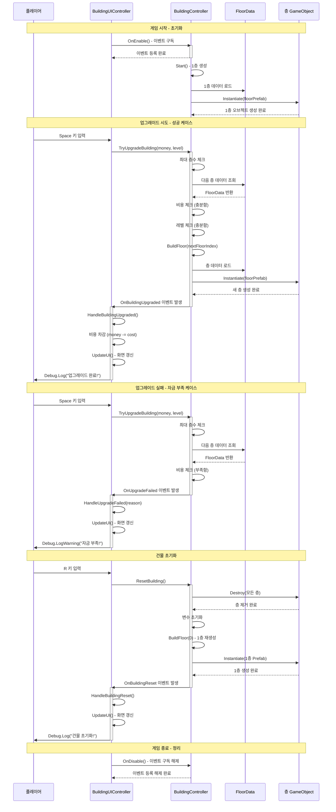

# 건물 업그레이드 시스템

## 시스템 구조

```mermaid
sequenceDiagram
    participant Player as 플레이어
    participant UI as BuildingUIController
    participant BC as BuildingController
    participant FD as FloorData
    participant Floor as 층 GameObject

    Note over Player,Floor: 게임 시작 - 초기화
    UI->>BC: OnEnable() - 이벤트 구독
    activate BC
    BC-->>UI: 이벤트 등록 완료
    deactivate BC
    BC->>BC: Start() - 1층 생성
    BC->>FD: 1층 데이터 로드
    BC->>Floor: Instantiate(floorPrefab)
    Floor-->>BC: 1층 오브젝트 생성 완료

    Note over Player,Floor: 업그레이드 시도 - 성공 케이스
    Player->>UI: Space 키 입력
    UI->>BC: TryUpgradeBuilding(money, level)
    activate BC
    BC->>BC: 최대 층수 체크
    BC->>FD: 다음 층 데이터 조회
    FD-->>BC: FloorData 반환
    BC->>BC: 비용 체크 (충분함)
    BC->>BC: 레벨 체크 (충분함)
    BC->>BC: BuildFloor(nextFloorIndex)
    BC->>FD: 층 데이터 로드
    BC->>Floor: Instantiate(floorPrefab)
    Floor-->>BC: 새 층 생성 완료
    BC->>UI: OnBuildingUpgraded 이벤트 발생 
    deactivate BC
    activate UI
    UI->>UI: HandleBuildingUpgraded()
    UI->>UI: 비용 차감 (money -= cost)
    UI->>UI: UpdateUI() - 화면 갱신
    UI->>Player: Debug.Log("업그레이드 완료!")
    deactivate UI

    Note over Player,Floor: 업그레이드 실패 - 자금 부족 케이스
    Player->>UI: Space 키 입력
    UI->>BC: TryUpgradeBuilding(money, level)
    activate BC
    BC->>BC: 최대 층수 체크
    BC->>FD: 다음 층 데이터 조회
    FD-->>BC: FloorData 반환
    BC->>BC: 비용 체크 (부족함)
    BC->>UI: OnUpgradeFailed 이벤트 발생
    deactivate BC
    activate UI
    UI->>UI: HandleUpgradeFailed(reason)
    UI->>UI: UpdateUI() - 화면 갱신
    UI->>Player: Debug.LogWarning("자금 부족!")
    deactivate UI

    Note over Player,Floor: 건물 초기화
    Player->>UI: R 키 입력
    UI->>BC: ResetBuilding()
    activate BC
    BC->>Floor: Destroy(모든 층)
    Floor-->>BC: 층 제거 완료
    BC->>BC: 변수 초기화
    BC->>BC: BuildFloor(0) - 1층 재생성
    BC->>Floor: Instantiate(1층 Prefab)
    Floor-->>BC: 1층 생성 완료
    BC->>UI: OnBuildingReset 이벤트 발생
    deactivate BC
    activate UI
    UI->>UI: HandleBuildingReset()
    UI->>UI: UpdateUI() - 화면 갱신
    UI->>Player: Debug.Log("건물 초기화!")
    deactivate UI

    Note over Player,Floor: 게임 종료 - 정리
    UI->>BC: OnDisable() - 이벤트 구독 해제
    BC-->>UI: 이벤트 등록 해제 완료
```
